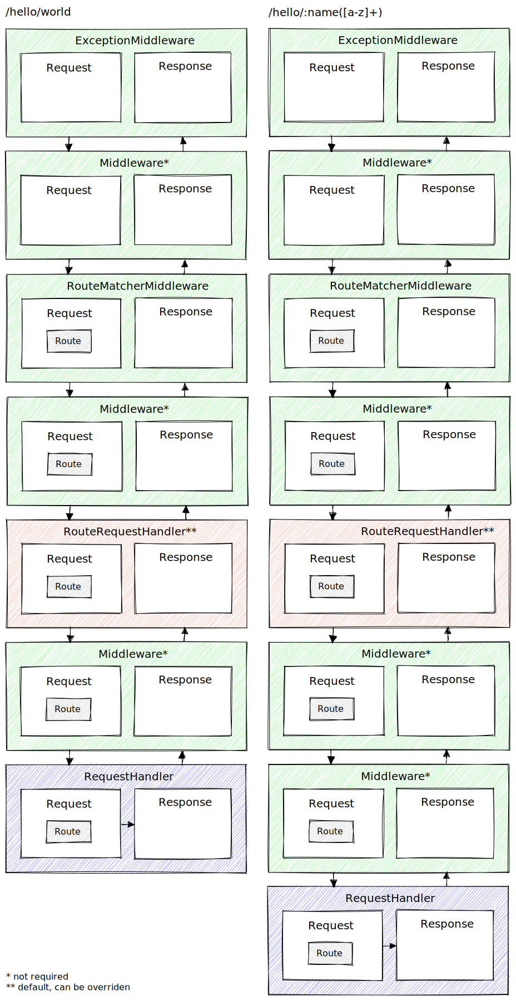

# chubbyphp-framework

[](https://github.com/chubbyphp/chubbyphp-framework/actions?query=workflow%3ACI)
[](https://coveralls.io/github/chubbyphp/chubbyphp-framework?branch=master)
[](https://dashboard.stryker-mutator.io/reports/github.com/chubbyphp/chubbyphp-framework/master)
[](https://packagist.org/packages/chubbyphp/chubbyphp-framework)
[](https://packagist.org/packages/chubbyphp/chubbyphp-framework)
[](https://packagist.org/packages/chubbyphp/chubbyphp-framework)

[](https://sonarcloud.io/dashboard?id=chubbyphp_chubbyphp-framework)
[](https://sonarcloud.io/dashboard?id=chubbyphp_chubbyphp-framework)
[](https://sonarcloud.io/dashboard?id=chubbyphp_chubbyphp-framework)
[](https://sonarcloud.io/dashboard?id=chubbyphp_chubbyphp-framework)
[](https://sonarcloud.io/dashboard?id=chubbyphp_chubbyphp-framework)
[](https://sonarcloud.io/dashboard?id=chubbyphp_chubbyphp-framework)
[](https://sonarcloud.io/dashboard?id=chubbyphp_chubbyphp-framework)
[](https://sonarcloud.io/dashboard?id=chubbyphp_chubbyphp-framework)
[](https://sonarcloud.io/dashboard?id=chubbyphp_chubbyphp-framework)
[](https://sonarcloud.io/dashboard?id=chubbyphp_chubbyphp-framework)
[](https://sonarcloud.io/dashboard?id=chubbyphp_chubbyphp-framework)

## Description

A minimal, highly [performant][1] middleware [PSR-15][8] microframework built with as little complexity as possible, aimed primarily at those developers who want to understand all the vendors they use.

 * [Basic Coding Standard (1)][2]
 * [Coding Style Guide (2)][3]
 * [Logger Interface (3)][4]
 * [Autoloading Standard (4)][5]
 * [HTTP Message Interface (7)][6]
 * [Container Interface (11)][7]
 * [HTTP Handlers (15)][8]
 * [HTTP Factories (17)][9]



## Requirements

 * php: ^8.1
 * [chubbyphp/chubbyphp-http-exception][20]: ^1.1
 * [psr/container][21]: ^1.1.2|^2.0.2
 * [psr/http-factory-implementation][22]: ^1.0
 * [psr/http-factory][23]: ^1.0.2
 * [psr/http-message-implementation][24]: ^1.0|^2.0
 * [psr/http-message][25]: ^1.1|^2.0
 * [psr/http-server-handler][26]: ^1.0.2
 * [psr/http-server-middleware][27]: ^1.0.2
 * [psr/log][28]: ^2.0|^3.0

## Suggest

### Router

Any Router which implements `Chubbyphp\Framework\Router\RouteMatcherInterface` can be used.

 * [chubbyphp/chubbyphp-framework-router-fastroute][30]: ^2.1

### PSR 7 / PSR 17

 * [guzzlehttp/psr7][40]: ^2.6.1 (with [http-interop/http-factory-guzzle][41]: ^1.2)
 * [laminas/laminas-diactoros][42]: ^3.3
 * [nyholm/psr7][43]: ^1.8.1
 * [slim/psr7][44]: ^1.6.1
 * [sunrise/http-message][45]: ^3.0

## Installation

Through [Composer](http://getcomposer.org) as [chubbyphp/chubbyphp-framework][60].

```bash
composer require chubbyphp/chubbyphp-framework "^5.1" \
    chubbyphp/chubbyphp-framework-router-fastroute "^2.1" \
    slim/psr7 "^1.5"
```

## Usage

```php
<?php

declare(strict_types=1);

namespace App;

use Chubbyphp\Framework\Application;
use Chubbyphp\Framework\Middleware\ExceptionMiddleware;
use Chubbyphp\Framework\Middleware\RouteMatcherMiddleware;
use Chubbyphp\Framework\RequestHandler\CallbackRequestHandler;
use Chubbyphp\Framework\Router\FastRoute\RouteMatcher;
use Chubbyphp\Framework\Router\Route;
use Chubbyphp\Framework\Router\RoutesByName;
use Psr\Http\Message\ServerRequestInterface;
use Slim\Psr7\Factory\ResponseFactory;
use Slim\Psr7\Factory\ServerRequestFactory;

require __DIR__.'/vendor/autoload.php';

$responseFactory = new ResponseFactory();

$app = new Application([
    new ExceptionMiddleware($responseFactory, true),
    new RouteMatcherMiddleware(new RouteMatcher(new RoutesByName([
        Route::get('/hello/{name:[a-z]+}', 'hello', new CallbackRequestHandler(
            static function (ServerRequestInterface $request) use ($responseFactory) {
                $response = $responseFactory->createResponse();
                $response->getBody()->write(sprintf('Hello, %s', $request->getAttribute('name')));

                return $response;
            }
        ))
    ]))),
]);

$app->emit($app->handle((new ServerRequestFactory())->createFromGlobals()));
```

### Emitter

 * [Emitter][65]

### Middleware

 * [CallbackMiddleware][70]
 * [ExceptionMiddleware][71]
 * [LazyMiddleware][72]
 * [MiddlewareDispatcher][73]
 * [RouteMatcherMiddleware][74]
 * [SlimCallbackMiddleware][75]
 * [SlimLazyMiddleware][76]

### RequestHandler

 * [CallbackRequestHandler][80]
 * [LazyRequestHandler][81]
 * [RouteRequestHandler][82]
 * [SlimCallbackRequestHandler][83]
 * [SlimLazyRequestHandler][84]

### Router

 * [Group][90]
 * [Route][91]

## Server

 * [Builtin (development only)][100]
 * [Nginx][101]
 * [ReactPHP][102]
 * [Roadrunner][103]
 * [Swoole][104]
 * [Workerman][105]

## Skeleton

 * [chubbyphp/chubbyphp-framework-skeleton][200]
 * [chubbyphp/petstore][201]

## Migration

 * [4.x to 5.x][213]
 * [3.x to 4.x][212]
 * [2.x to 3.x][211]
 * [1.x to 2.x][210]
 * [Slim to Chubbyphp][219]

## Copyright

2024 Dominik Zogg

[1]: https://web-frameworks-benchmark.netlify.app/result

[2]: https://www.php-fig.org/psr/psr-1
[3]: https://www.php-fig.org/psr/psr-2
[4]: https://www.php-fig.org/psr/psr-3
[5]: https://www.php-fig.org/psr/psr-4
[6]: https://www.php-fig.org/psr/psr-7
[7]: https://www.php-fig.org/psr/psr-11
[8]: https://www.php-fig.org/psr/psr-15
[9]: https://www.php-fig.org/psr/psr-17

[15]: https://travis-ci.org/chubbyphp/chubbyphp-framework

[20]: https://packagist.org/packages/chubbyphp/chubbyphp-http-exception
[21]: https://packagist.org/packages/psr/container
[22]: https://packagist.org/packages/psr/http-factory-implementation
[23]: https://packagist.org/packages/psr/http-factory
[24]: https://packagist.org/packages/psr/http-message-implementation
[25]: https://packagist.org/packages/psr/http-message
[26]: https://packagist.org/packages/psr/http-server-handler
[27]: https://packagist.org/packages/psr/http-server-middleware
[28]: https://packagist.org/packages/psr/log

[30]: https://github.com/chubbyphp/chubbyphp-framework-router-fastroute#usage

[40]: https://packagist.org/packages/guzzlehttp/psr7
[41]: https://packagist.org/packages/http-interop/http-factory-guzzle
[42]: https://packagist.org/packages/laminas/laminas-diactoros
[43]: https://packagist.org/packages/nyholm/psr7
[44]: https://packagist.org/packages/slim/psr7
[45]: https://packagist.org/packages/sunrise/http-message

[60]: https://packagist.org/packages/chubbyphp/chubbyphp-framework

[65]: doc/Emitter/Emitter.md

[70]: doc/Middleware/CallbackMiddleware.md
[71]: doc/Middleware/ExceptionMiddleware.md
[72]: doc/Middleware/LazyMiddleware.md
[73]: doc/Middleware/MiddlewareDispatcher.md
[74]: doc/Middleware/RouteMatcherMiddleware.md
[75]: doc/Middleware/SlimCallbackMiddleware.md
[76]: doc/Middleware/SlimLazyMiddleware.md

[80]: doc/RequestHandler/CallbackRequestHandler.md
[81]: doc/RequestHandler/LazyRequestHandler.md
[82]: doc/RequestHandler/RouteRequestHandler.md
[83]: doc/RequestHandler/SlimCallbackRequestHandler.md
[84]: doc/RequestHandler/SlimLazyRequestHandler.md

[90]: doc/Router/Group.md
[91]: doc/Router/Route.md

[100]: doc/Server/Builtin.md
[101]: doc/Server/Nginx.md
[102]: doc/Server/ReactPHP.md
[103]: doc/Server/Roadrunner.md
[104]: https://github.com/chubbyphp/chubbyphp-swoole-request-handler#usage
[105]: https://github.com/chubbyphp/chubbyphp-workerman-request-handler#usage

[200]: https://packagist.org/packages/chubbyphp/chubbyphp-framework-skeleton
[201]: https://packagist.org/packages/chubbyphp/petstore

[210]: doc/Migration/1.x-2.x.md
[211]: doc/Migration/2.x-3.x.md
[212]: doc/Migration/3.x-4.x.md
[213]: doc/Migration/4.x-5.x.md

[219]: doc/Migration/Slim-Chubbyphp.md
